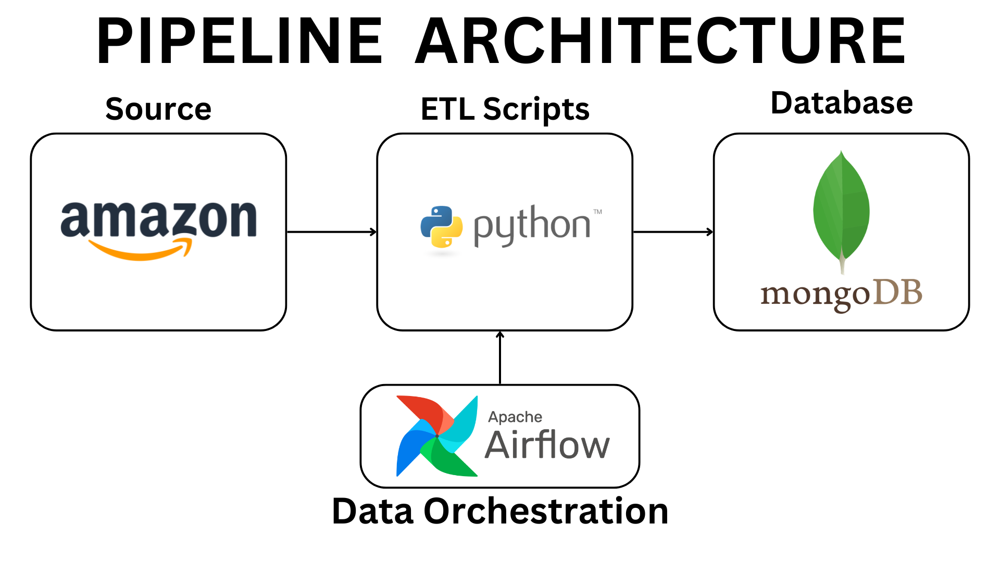

# Amazon ETL Pipeline

## Table of Contents

- [ETL Pipeline Overview](#etl-pipeline-overview)
  - [Extract](#extract)
  - [Transform](#transform)
  - [Load](#load)
  - [DAG Script for Apache Airflow](#dag-script-for-apache-airflow)
- [Opportunities for Improvement](#opportunities-for-improvement)

## ETL Pipeline Overview

This ETL pipeline is an expansion of my previous project [Amazon Bestseller PC Gaming Mice Analysis](https://github.com/raufh10/Amazon_Gaming_Mice_Data_Analysis), which included an ETL component. I have now developed it into a full ETL pipeline. I'm using Python for extracting, transforming, and loading the data, specifically utilizing BeautifulSoup (bs4) and Playwright for web scraping. For pipeline orchestration, I use Apache Airflow, and for the database, I use NoSQL database MongoDB. This project focuses solely on building the pipeline, not on constructing a data warehouse.

Here are picture of pipeline architecture:

## Opportunities for Improvement

There are several opportunities for improvement in the ETL pipeline:

1. **Parallel Pipeline for Monitoring**: Implement a parallel pipeline that runs concurrently with the main pipeline to monitor its performance and measure processing metrics, ensuring real-time tracking and optimization.
2. **Error Handling**: Enhance error handling mechanisms to catch and respond to exceptions more effectively, reducing downtime and ensuring the pipeline's reliability.
